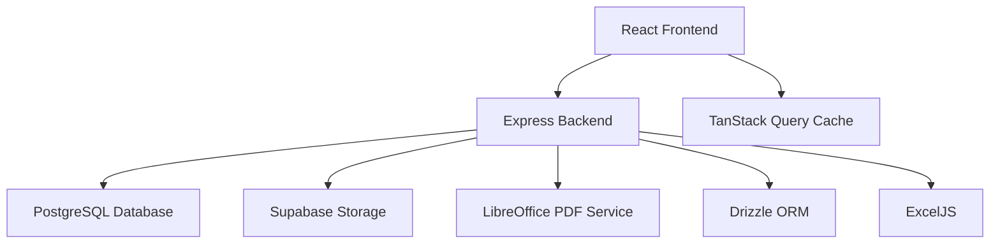

# 🏗️ OTIS APROD - TELJES TECHNIKAI DOKUMENTÁCIÓ

## 📖 **TARTALOMJEGYZÉK**
1. [Alkalmazás Áttekintés](#alkalmazás-áttekintés)
2. [Architektúra és Technológiai Stack](#architektúra-és-technológiai-stack)
3. [Adatbázis Séma és Adatmodell](#adatbázis-séma-és-adatmodell)
4. [Backend API és Szolgáltatások](#backend-api-és-szolgáltatások)
5. [Frontend Komponensek és Oldalak](#frontend-komponensek-és-oldalak)
6. [Fájl Struktúra és Szervezés](#fájl-struktúra-és-szervezés)
7. [Speciális Funkciók és Modulok](#speciális-funkciók-és-modulok)
8. [Deployment és Környezetek](#deployment-és-környezetek)
9. [Fejlesztési Útmutató](#fejlesztési-útmutató)
10. [API Referencia](#api-referencia)

---

## 🎯 **ALKALMAZÁS ÁTTEKINTÉS**

### **Mi ez az alkalmazás?**
Az OTIS APROD egy **full-stack TypeScript alkalmazás**, amely digitalizálja az OTIS elevator átvételi protokoll folyamatot. A rendszer **step-by-step kérdőívekkel**, **hibadokumentációval**, **PDF generálással** és **megosztási funkciókkal** rendelkezik.

### **Fő Célok:**
- 📋 **Papír-alapú protokollok digitalizálása**
- ⚡ **Munkafolyamat egyszerűsítése** OTIS technikusok számára
- 🔄 **Automatizált Excel ↔ PDF konverzió** formátum megőrzéssel
- 🌐 **Magyar és német nyelvi támogatás**
- 📱 **Mobil-első, tablet-optimalizált felület**

### **Felhasználók:**
- **OTIS technikusok:** Kérdőívek kitöltése, mérések rögzítése
- **Adminisztrátorok:** Template kezelés, konfigurációs beállítások
- **Vezetők:** PDF riportok áttekintése, adatok elemzése

---

## 🏛️ **ARCHITEKTÚRA ÉS TECHNOLÓGIAI STACK**

### **Alkalmazás Architektúra**


### **Frontend Stack**
- **Framework:** React 18 + TypeScript
- **Routing:** Wouter (lightweight routing)
- **UI Library:** Shadcn/ui + Radix UI + TailwindCSS
- **State Management:** React Context + hooks + localStorage
- **Data Fetching:** TanStack Query v5
- **Build Tool:** Vite

### **Backend Stack**
- **Runtime:** Node.js + Express.js
- **Language:** TypeScript
- **Database ORM:** Drizzle ORM
- **Storage:** Supabase Storage (production) + Local (development)
- **PDF Generation:** LibreOffice (headless)
- **Excel Processing:** ExcelJS library
- **Validation:** Zod schema validation

### **Database & Storage**
- **Production:** PostgreSQL (Neon-backed Replit Database)
- **Development:** SQLite (local file)
- **Cloud Storage:** Supabase Storage (template files, images)
- **Local Storage:** Browser localStorage (form persistence)

---

## 🗃️ **ADATBÁZIS SÉMA ÉS ADATMODELL**

### **Főbb Táblák**

#### **1. `templates` - Template Fájlok**
```typescript
export const templates = pgTable("templates", {
  id: uuid("id").primaryKey().$defaultFn(() => crypto.randomUUID()),
  name: text("name").notNull(),                    // Template neve
  type: text("type").notNull(),                    // "protocol" | "unified"
  file_name: text("file_name").notNull(),          // Eredeti fájlnév
  file_path: text("file_path").notNull(),          // Supabase storage path
  language: text("language").notNull().default("multilingual"), // "hu" | "de" | "multilingual"
  uploaded_at: timestamp("uploaded_at").defaultNow().notNull(),
  is_active: boolean("is_active").notNull().default(false), // Aktív template flag
});
```

#### **2. `question_configs` - Kérdés Konfigurációk**
```typescript
export const questionConfigs = pgTable("question_configs", {
  id: uuid("id").primaryKey().$defaultFn(() => crypto.randomUUID()),
  template_id: uuid("template_id").references(() => templates.id, { onDelete: "cascade" }),
  question_id: text("question_id").notNull(),      // "1", "2", "m1", "calc1"
  title_hu: text("title_hu").notNull(),            // Magyar cím
  title_de: text("title_de"),                      // Német cím
  type: text("type").notNull(),                    // "text" | "radio" | "number" | "measurement" | "calculated"
  required: boolean("required").notNull().default(false),
  placeholder: text("placeholder"),                // Input placeholder
  cell_reference: text("cell_reference"),          // Excel cella hivatkozás "B2" | "A1,B1,C1"
  sheet_name: text("sheet_name"),                  // Excel munkalap neve
  multi_cell: boolean("multi_cell").default(false), // Több cellás kérdés flag
  group_name: text("group_name"),                  // Csoport neve (magyar)
  group_name_de: text("group_name_de"),            // Csoport neve (német)
  group_order: integer("group_order").default(0),  // Csoport sorrendje
  unit: text("unit"),                              // Mértékegység "kg", "m/s"
  min_value: integer("min_value"),                 // Minimum érték validációhoz
  max_value: integer("max_value"),                 // Maximum érték validációhoz
  calculation_formula: text("calculation_formula"), // "m1 - m3" formula
  calculation_inputs: text("calculation_inputs"),  // "m1,m3" input lista
  conditional_group_key: text("conditional_group_key"), // Feltételes megjelenítés kulcs
});
```

#### **3. `protocols` - Protokoll Példányok**
```typescript
export const protocols = pgTable("protocols", {
  id: uuid("id").primaryKey().$defaultFn(() => crypto.randomUUID()),
  answers: text("answers").notNull(),               // JSON string: kérdés válaszok
  signature_data: text("signature_data"),           // Base64 aláírás
  signer_name: text("signer_name"),                // Aláíró neve
  reception_date: text("reception_date"),           // Átvételi dátum YYYY-MM-DD
  created_at: timestamp("created_at").defaultNow().notNull(),
  updated_at: timestamp("updated_at").defaultNow().notNull(),
  
  // Niedervolt specifikus mezők
  niedervolt_measurements: text("niedervolt_measurements"), // JSON: mérési adatok
  grounding_check_answers: text("grounding_check_answers"), // JSON: földelés ellenőrzés
  protocol_errors: text("protocol_errors"),        // JSON: hibák dokumentációja
});
```

#### **4. `protocol_errors` - Hibadokumentáció**
```typescript
export const protocolErrors = pgTable("protocol_errors", {
  id: uuid("id").primaryKey().$defaultFn(() => crypto.randomUUID()),
  protocol_id: uuid("protocol_id").references(() => protocols.id, { onDelete: "cascade" }),
  error_type: text("error_type").notNull(),        // "visual" | "functional" | "safety"
  description: text("description").notNull(),      // Hiba leírása
  location: text("location"),                      // Hiba helye
  severity: text("severity").notNull(),            // "low" | "medium" | "high" | "critical"
  image_path: text("image_path"),                  // Kép URL (ha van)
  created_at: timestamp("created_at").defaultNow().notNull(),
});
```

### **Adatkapcsolatok**
- `question_configs` → `templates` (many-to-one)
- `protocol_errors` → `protocols` (many-to-one)
- JSON mezők: `answers`, `niedervolt_measurements`, `grounding_check_answers`

---

## 🔧 **BACKEND API ÉS SZOLGÁLTATÁSOK**

### **Fő API Endpoints**

#### **1. Kérdések API (`/api/questions`)**
```typescript
// Kérdések lekérése nyelvenkénti
GET /api/questions/:language        // "hu" | "de"

// Feltételes kérdések szűrése
POST /api/questions/filter         
Body: { language: string, conditions: string[] }
```

#### **2. Template Management (`/api/admin/templates`)**
```typescript
// Template lista
GET /api/admin/templates

// Template feltöltés
POST /api/admin/templates/upload
Content-Type: multipart/form-data

// Template aktiválás
POST /api/admin/templates/:id/activate

// Template törlés
DELETE /api/admin/templates/:id

// Elérhető template-ek (local + remote)
GET /api/admin/templates/available
```

#### **3. Protokoll API (`/api/protocols`)**
```typescript
// Protokoll létrehozás
POST /api/protocols
Body: { answers: object, signature_data?: string, ... }

// Protokoll frissítés
PUT /api/protocols/:id

// PDF letöltés
GET /api/protocols/:id/download-pdf

// Excel letöltés
GET /api/protocols/:id/download-excel

// Erdungskontrolle PDF
POST /api/protocols/download-grounding-pdf
Body: { answers: object, receptionDate: string }
```

#### **4. Niedervolt API (`/api/niedervolt`)**
```typescript
// Niedervolt eszközök lekérése
GET /api/niedervolt/devices

// Protocol mapping (Niedervolt → Otis)
POST /api/protocols/write-mapping
Body: { protocolId: string, writes: Array<{questionId, cellReference, value}> }
```

#### **5. Fájl Feltöltés (`/api/upload`)**
```typescript
// Kép feltöltés hibadokumentációhoz
POST /api/upload
Content-Type: multipart/form-data
```

### **Főbb Backend Szolgáltatások**

#### **1. `hybrid-template-loader.ts` - Template Betöltő**
```typescript
class HybridTemplateLoader {
  // Template betöltés local/remote stratégiával
  async loadTemplate(templateId: string, type: string, language: string): Promise<TemplateResult>
  
  // Local template listázás
  async getLocalTemplates(): Promise<TemplateInfo[]>
  
  // Remote (Supabase) template listázás  
  async getRemoteTemplates(): Promise<TemplateInfo[]>
}
```

**Működés:**
1. **Local First:** Először helyi template-eket keres (`public/templates/`)
2. **Remote Fallback:** Ha nincs helyi, Supabase Storage-ból tölt
3. **Cache:** Memóriában cache-eli a betöltött template-eket
4. **Error Handling:** Graceful fallback hibás template esetén

#### **2. `excel-parser.ts` - Excel Feldolgozó**
```typescript
class ExcelParserService {
  // Kérdések kinyerése Excel template-ből
  async parseQuestionsFromExcel(filePath: string): Promise<QuestionConfig[]>
  
  // Excel header oszlopok detektálása
  private detectHeaders(worksheet: any): { [key: string]: number }
  
  // Multi-cell kérdések feldolgozása
  private parseMultiCellReference(cellRef: string): string[]
}
```

**Excel Struktúra Feldolgozás:**
- **Header sorban:** `ID`, `titleHu`, `titleDe`, `Type`, `cellReference`, `Unit`, stb.
- **Multi-cell support:** `A1,B1,C1` vagy `A1;A2;A3,B1;B2;B3,C1;C2;C3` formátumok
- **Validation:** Zod sémával validálja a kinyert adatokat

#### **3. `excel-service.ts` - Excel Generálás**
```typescript
class ExcelService {
  // Protokoll Excel generálás
  async generateProtocolExcel(protocol: Protocol, templateId?: string): Promise<Buffer>
  
  // Cellák írása Excel template-be
  private async writeCellsToExcel(workbook: ExcelJS.Workbook, writes: CellWrite[]): Promise<void>
  
  // Formula értékek számítása
  private evaluateFormula(formula: string, values: Record<string, number>): number
}
```

**Excel Manipulation:**
- **Template alapú:** Meglévő Excel template módosítása
- **Cell mapping:** `cellReference` alapján pontos cellák írása
- **Format preservation:** Eredeti Excel formázás megőrzése
- **Formula support:** Automatikus számítások kezelése

#### **4. `pdf-service.ts` - PDF Generálás**
```typescript
class PDFService {
  // Excel → PDF konverzió LibreOffice-szal
  async generatePDF(excelBuffer: Buffer, filename: string): Promise<Buffer>
  
  // Temporary fájl kezelés
  private async createTempFile(buffer: Buffer, extension: string): Promise<string>
}
```

**PDF Conversion Flow:**
1. **Excel Buffer → Temp File:** Excel buffer ideiglenes fájlba írása
2. **LibreOffice Conversion:** `libreoffice --headless --convert-to pdf`
3. **PDF Buffer:** Generált PDF fájl beolvasása buffer-be
4. **Cleanup:** Ideiglenes fájlok törlése

#### **5. `filename-corrections.ts` - Fájlnév Javító**
```typescript
// 5-szintű fájlnév javítási stratégia
async function executeWithFilenameStrategies<T>(
  originalPath: string,
  operation: (path: string) => Promise<T>,
  operationType: 'download' | 'delete'
): Promise<T>
```

**Correction Strategies:**
1. **Original:** Eredeti fájlnév próbálása
2. **Simple Corrections:** Gyakori karaktercserék (`é` → `é`)
3. **UTF-8 Decode:** UTF-8 dekódolási kísérletek
4. **ASCII Cleanup:** ASCII karakterekre szűkítés
5. **Safe Fallback:** Biztonságos fallback karakterek

---

## 🎨 **FRONTEND KOMPONENSEK ÉS OLDALAK**

### **Fő Oldalak (`src/pages/`)**

#### **1. `start-screen.tsx` - Kezdőlap**
```typescript
// Funkciók:
- Új protokoll indítása
- Meglévő protokoll folytatása (localStorage)
- Nyelv választás (hu/de)
- Admin hozzáférés
- PWA telepítési prompt
```

#### **2. `questionnaire.tsx` - Kérdőív**
```typescript
// Főbb funkciók:
- Dinamikus kérdés betöltés template alapján
- Feltételes kérdés szűrés
- Real-time validáció
- Auto-save localStorage-ba
- Progress tracking
- Measurement és calculated típusú kérdések

// Komponens struktúra:
<PageHeader />
<Progress bar />
<QuestionGroups>
  <TrueFalseGroup />      // Radio button kérdések
  <MeasurementQuestion />  // Mérési adatok
  <IsolatedQuestion />     // Egyedi kérdések
</QuestionGroups>
<Navigation />
```

#### **3. `niedervolt-table.tsx` - Niedervolt Táblázat**
```typescript
// Funkciók:
- Dinamikus eszköz betöltés
- Excel-szerű táblázat szerkesztés
- FI mérések (N-PE, L1-PE, L2-PE, L3-PE)
- Biztosíték és kismegszakító dropdown-ok
- Custom eszköz hozzáadás
- Otis protokollba mentés (automatikus mapping)
- Device selection/filtering

// Technikai implementáció:
- Controlled inputs debouncing-gal
- Global Map cache radio button state-ekhez
- CSV export/import funkciók
- Real-time validáció
```

#### **4. `erdungskontrolle.tsx` - Földelés Ellenőrzés**
```typescript
// Funkciók:
- JSON-alapú kérdések betöltése
- 5 fő kérdéscsoport (Gépház, Kabin teteje, Akna, Aknagödör, Kabin)
- Yes/No válaszok automatic error tracking-gel
- PDF generálás backend service-szel
- Progress tracking

// Adatstruktúra:
interface GroundingData {
  groups: Array<{
    id: string;
    title: string;
    questions: Array<{
      id: string;
      text: string;
    }>;
  }>;
}
```

#### **5. `signature.tsx` - Digitális Aláírás**
```typescript
// Funkciók:
- Canvas-alapú aláírás rajzolás
- Touch és mouse support
- Aláírás preview és törlés
- Aláíró név megadása
- Base64 aláírás exportálás
- Responsive canvas sizing
```

#### **6. `completion.tsx` - Befejezés**
```typescript
// Funkciók:
- Protokoll összefoglalás
- PDF generálás és letöltés
- Excel export
- Email küldés (Resend API)
- QR kód generálás megosztáshoz
- Új protokoll indítása
```

#### **7. `admin.tsx` - Admin Interface**
```typescript
// Funkciók:
- Template lista (local + remote)
- Template feltöltés drag&drop-pal
- Template aktiválás/deaktiválás
- Template törlés confirmation-nel
- Cache kezelés (manual clear)
- Template preview
- Error handling és feedback
```

### **Közös Komponensek (`src/components/`)**

#### **1. `PageHeader.tsx` - Oldal Fejléc**
```typescript
// Funkciók:
- OTIS branding
- Progress indicator
- Nyelv váltó
- Navigation breadcrumb
- Mobile-responsive hamburger menu
```

#### **2. `true-false-group.tsx` - Radio Csoport**
```typescript
// Funkciók:
- Grouped radio button questions
- Cache-elt state management
- Automatic error detection (false answers)
- Conditional question triggering
- Visual feedback (colors, icons)
```

#### **3. `measurement-question.tsx` - Mérési Kérdés**
```typescript
// Funkciók:
- Numeric input validation
- Unit display (kg, m/s, mm)
- Min/max value checking
- Error state visualization
- Auto-calculation trigger
```

#### **4. `conditional-question-filter.tsx` - Feltételes Szűrő**
```typescript
// Funkciók:
- Real-time question visibility control
- Dependency tracking between questions
- Smooth show/hide animations
- API-based filtering with caching
```

### **Hooks és Utilities**

#### **1. `use-language.ts` - Nyelvi Hook**
```typescript
const useLanguage = () => {
  const [language, setLanguage] = useState<'hu' | 'de'>('hu');
  const t = (key: string) => translations[language][key] || key;
  return { language, setLanguage, t };
};
```

#### **2. `queryClient.ts` - TanStack Query Konfiguráció**
```typescript
// Global query konfiguráció:
- 5 perc cache time
- 1 retry failed query-kre
- Automatic refetch on window focus
- Global error handling
- Request/response interceptors
```

---

## 📁 **FÁJL STRUKTÚRA ÉS SZERVEZÉS**

### **Project Root Struktúra**
```
otis-aprod/
├── src/                          # Frontend forráskód
│   ├── components/               # React komponensek
│   │   ├── ui/                   # Shadcn/ui komponensek
│   │   ├── PageHeader.tsx
│   │   ├── true-false-group.tsx
│   │   └── ...
│   ├── pages/                    # Oldal komponensek
│   │   ├── start-screen.tsx
│   │   ├── questionnaire.tsx
│   │   ├── niedervolt-table.tsx
│   │   └── ...
│   ├── lib/                      # Utility függvények
│   │   ├── utils.ts
│   │   ├── types.ts
│   │   ├── translations.ts
│   │   └── queryClient.ts
│   ├── services/                 # Frontend service-ek
│   │   ├── mappingService.ts
│   │   └── excelWriteService.ts
│   ├── hooks/                    # Custom React hooks
│   │   ├── use-toast.ts
│   │   └── use-language.ts
│   └── App.tsx                   # Fő App komponens
├── server/                       # Backend forráskód
│   ├── services/                 # Backend service-ek
│   │   ├── hybrid-template-loader.ts
│   │   ├── excel-parser.ts
│   │   ├── excel-service.ts
│   │   ├── pdf-service.ts
│   │   ├── grounding-excel-service.ts
│   │   └── supabase-storage.ts
│   ├── routes/                   # API route modulok
│   │   ├── protocol-mapping.ts
│   │   └── error-routes.ts
│   ├── utils/                    # Backend utility-k
│   │   └── filename-corrections.ts
│   ├── config/                   # Konfigurációs fájlok
│   │   └── local-templates.ts
│   ├── routes.ts                 # Fő API routes
│   ├── storage.ts                # Database storage layer
│   └── index.ts                  # Express szerver entry point
├── shared/                       # Közös típusok és sémák
│   ├── schema.ts                 # PostgreSQL séma (Drizzle)
│   ├── schema-sqlite.ts          # SQLite séma (development)
│   └── types.ts                  # Shared TypeScript típusok
├── public/                       # Statikus fájlok
│   ├── templates/                # Helyi Excel template-ek
│   ├── questions_grounding_hu.json
│   ├── questions_grounding_de.json
│   └── otis-logo.png
├── data/                         # Local adatbázis fájlok
│   └── otis_aprod.db             # SQLite development DB
├── uploads/                      # Temp upload könyvtár
├── package.json                  # Dependencies és scripts
├── vite.config.ts                # Vite konfiguráció
├── tailwind.config.js            # TailwindCSS konfiguráció
└── tsconfig.json                 # TypeScript konfiguráció
```

### **Kód Szervezési Elvek**

#### **1. Modular Architecture**
- **Frontend:** Komponens-alapú React architektúra
- **Backend:** Service layer pattern Express route-okkal
- **Shared:** Közös típusok és sémák mindkét oldalon használhatók

#### **2. Separation of Concerns**
- **Routes:** Csak HTTP kérés/válasz kezelés
- **Services:** Üzleti logika és külső service-ek
- **Storage:** Adatbázis műveletek (Repository pattern)
- **Components:** UI rendering és event handling

#### **3. TypeScript Everywhere**
- **Strict typing:** Minden fájl TypeScript
- **Shared types:** `shared/` könyvtárban közös típusok
- **Schema validation:** Zod sémák runtime validációhoz

---

## ⚙️ **SPECIÁLIS FUNKCIÓK ÉS MODULOK**

### **1. Template Management System**

#### **Hibrid Template Loader**
```typescript
// Betöltési prioritás:
1. Local templates (public/templates/)
2. Remote templates (Supabase Storage)
3. Fallback to default template

// Cache stratégia:
- Memory cache active template-ekhez
- Automatic cache invalidation activation esetén
- Template versioning support
```

#### **Excel Template Processing**
```typescript
// Supported formátumok:
- .xlsx (Office 2007+)
- .xls (Legacy Excel)

// Template struktúra:
- Header row: ID, titleHu, titleDe, Type, cellReference, Unit, ...
- Multi-cell support: "A1,B1,C1" vagy complex "A1;A2,B1;B2" formátumok
- Calculated questions: Formula és input dependencies
```

### **2. Niedervolt → Otis Automatic Mapping**

#### **Mapping Service Működése**
```typescript
// 1. Frontend: Niedervolt adatok összegyűjtése
const niedervoltMappings = selectedDevices.map(deviceId => ({
  deviceId,
  deviceName: getDeviceName(deviceId),
  measurements: measurements[deviceId]
}));

// 2. Automatic question ID generation
const questionId = `Q_NID_${deviceId}_${field}`;  // pl: "Q_NID_device-1_npe"

// 3. Backend: Cell reference resolution
const mapping = await getCellMappingForQuestion(questionId);
const cellReference = mapping?.cellReference || `TBD_${deviceId}_${field}`;

// 4. Excel writing
await excelService.writeCellsToExcel(workbook, writes);
```

#### **Supported FI Measurements**
```typescript
interface NiedervoltMeasurement {
  nevlegesAram: string;        // Névleges áram (A)
  tipusjelzes: string;         // Típusjelzés
  szigetelesVizsgalat: string; // Szigetelés vizsgálat (MΩ)
  rovidzarasiAram: string;     // Rövidzárási áram (Icc)
  biztositek: string;          // Biztosíték dropdown
  kismegszakito: string;       // Kismegszakító dropdown
  npe: string;                 // N-PE (Ω)
  l1pe: string;                // L1-PE (Ω)
  l2pe: string;                // L2-PE (Ω)
  l3pe: string;                // L3-PE (Ω)
  ln: string;                  // L-N (Ω)
  lpe: string;                 // L-PE (Ω)
  fiIn: string;                // FI In (mA)
  fiDin: string;               // FI ΔIn (ms)
  fiTest: string;              // FI teszt dropdown
}
```

### **3. Erdungskontrolle (Grounding Control) Module**

#### **JSON-Based Question System**
```typescript
// questions_grounding_hu.json struktúra:
{
  "groups": [
    {
      "id": "maschinenraum",
      "title": "1. Ellenőrzés a gépházban",
      "questions": [
        { "id": "grd_mr_ref", "text": "Referencia földelés meglétele" },
        { "id": "grd_mr_controller", "text": "Vezérlő burkolata és ajtói" }
      ]
    }
  ]
}
```

#### **Automatic Error Detection**
```typescript
// False válasz = automatikus hiba
const handleAnswerChange = (questionId: string, value: boolean) => {
  if (!value) {
    // False válasz esetén hiba hozzáadása
    addProtocolError({
      type: "grounding",
      description: questionText,
      severity: "high"
    });
  } else {
    // True válasz esetén hiba eltávolítása
    removeProtocolError(questionId);
  }
};
```

### **4. PDF Generation Pipeline**

#### **Excel → PDF Conversion Flow**
```typescript
// 1. Template betöltés
const templateBuffer = await hybridTemplateLoader.loadTemplate(templateId);

// 2. Excel manipulation
const workbook = new ExcelJS.Workbook();
await workbook.xlsx.load(templateBuffer);
await excelService.writeCellsToExcel(workbook, cellWrites);

// 3. LibreOffice conversion
const pdfBuffer = await pdfService.generatePDF(excelBuffer, filename);

// 4. Response vagy fájl mentés
res.setHeader('Content-Type', 'application/pdf');
res.setHeader('Content-Disposition', `attachment; filename="${filename}"`);
res.send(pdfBuffer);
```

### **5. Multi-Language Support**

#### **Translation System**
```typescript
// translations.ts
export const translations = {
  hu: {
    "start_new_protocol": "Új protokoll indítása",
    "continue_protocol": "Protokoll folytatása",
    // ...
  },
  de: {
    "start_new_protocol": "Neues Protokoll starten", 
    "continue_protocol": "Protokoll fortsetzen",
    // ...
  }
};

// Használat komponensekben:
const { t, language } = useLanguageContext();
return <button>{t("start_new_protocol")}</button>;
```

#### **Dynamic Content Loading**
```typescript
// Template-based content:
const title = language === 'de' && config.titleDe ? config.titleDe : config.titleHu;
const groupName = language === 'de' && config.groupNameDe ? config.groupNameDe : config.groupName;

// JSON-based content (Erdungskontrolle):
const response = await fetch(`/questions_grounding_${language}.json`);
```

---

## 🚀 **DEPLOYMENT ÉS KÖRNYEZETEK**

### **Development Environment**

#### **Local Setup**
```bash
# 1. Dependencies telepítése
npm install

# 2. Environment fájl
cp .env.example .env

# 3. Database setup (SQLite development)
npm run db:generate    # Drizzle migrations generálás
npm run db:push        # Schema sync adatbázisba

# 4. Development server indítás
npm run dev
```

#### **Environment Variables**
```bash
# Database
DATABASE_URL=          # PostgreSQL connection string (production)

# Supabase Storage
SUPABASE_URL=          # Supabase project URL
SUPABASE_ANON_KEY=     # Supabase anonymous key

# Email (Resend)
RESEND_API_KEY=        # Email küldéshez

# Development
NODE_ENV=development   # development | production
```

### **Production Deployment (Vercel)**

#### **Build Configuration**
```json
// package.json scripts:
{
  "build": "npm run build:frontend && npm run build:backend",
  "build:frontend": "vite build",
  "build:backend": "tsc server --outDir dist-server",
  "start": "node dist-server/index.js"
}
```

#### **Vercel Configuration**
```json
// vercel.json
{
  "version": 2,
  "builds": [
    { "src": "dist-server/index.js", "use": "@vercel/node" },
    { "src": "dist/**", "use": "@vercel/static" }
  ],
  "routes": [
    { "src": "/api/(.*)", "dest": "/dist-server/index.js" },
    { "src": "/(.*)", "dest": "/dist/index.html" }
  ]
}
```

### **Database Management**

#### **Schema Migrations**
```bash
# Development (SQLite)
npm run db:push --force    # Force schema sync

# Production (PostgreSQL)
npm run db:migrate        # Run migrations
npm run db:studio         # Drizzle Studio GUI
```

#### **Backup Strategy**
```bash
# SQLite backup
cp data/otis_aprod.db data/backup-$(date +%Y%m%d).db

# PostgreSQL backup (Replit built-in)
# Automatic checkpoint system
```

---

## 🔄 **ARCHITEKTURÁLIS REFAKTORÁLÁS: EGYSÉGES NYELVI STRUKTÚRA**

### **Jelenlegi Probléma**
A korábbi implementáció **duplikált nyelvi mezőket** használt minden entitáshoz:
- `titleHu` és `titleDe` külön mezők
- `groupName` és `groupNameDe` külön mezők
- Frontend `useLanguageContext()` konfliktus a backend nyelvvel
- `groupName` egyszerre logikai azonosító és megjelenítési cím

### **Új Architektúra (v0.6.0+)**

#### **Objektum-alapú Nyelvi Struktúra**
```typescript
// ÚJ STRUKTÚRA - Egységes és bővíthető
{
  "id": "Q12",
  "title": {
    "hu": "Kérdés magyarul",
    "de": "Frage auf Deutsch"
  },
  "group": {
    "key": "electrical_check",        // Logikai azonosító
    "title": {
      "hu": "Villamos ellenőrzés",
      "de": "Elektrische Prüfung"
    }
  },
  "conditional_key": "section_A",     // Külön feltételes logika
  "type": "yes_no_na"
}

// RÉGI STRUKTÚRA - Duplikált és korlátozó
{
  "id": "Q12",
  "titleHu": "Kérdés magyarul",
  "titleDe": "Frage auf Deutsch",
  "groupName": "Villamos ellenőrzés",
  "groupNameDe": "Elektrische Prüfung",
  "conditional_group_key": "section_A",
  "type": "yes_no_na"
}
```

#### **Előnyök**
| Szempont | Régi | Új |
|----------|------|-----|
| Nyelvi kezelés | Duplikált mezők | Egységes `title: { hu, de }` |
| Bővíthetőség | Nehéz új nyelv hozzáadása | `title.en` egyszerűen hozzáadható |
| Csoportosítás | `groupName` keveri logika+UI | `group.key` és `group.title` külön |
| Feltételes logika | `groupName`-hez kötött | `conditional_key` önálló |
| Hibalehetőség | Magas (kettős fordítás) | Alacsony (backend adja a nyelvet) |

#### **Backend Implementáció**
```typescript
// server/routes.ts - Új formázás
const formattedQuestions = questionsCache.map((config) => ({
  id: config.questionId,
  title: {
    hu: config.titleHu || config.title,
    de: config.titleDe || config.title
  },
  group: {
    key: config.groupKey || slugify(config.groupName),
    title: {
      hu: config.groupName,
      de: config.groupNameDe || config.groupName
    }
  },
  conditional_key: config.conditionalGroupKey,
  type: config.type,
  // ... további mezők
}));
```

#### **Frontend Használat**
```typescript
// Questionnaire.tsx - Csoportosítás
const groupedByKey = questions.reduce((acc, q) => {
  const key = q.group.key;
  if (!acc[key]) acc[key] = [];
  acc[key].push(q);
  return acc;
}, {});

// TrueFalseGroup.tsx - Megjelenítés
<h3>{group.title[language]}</h3>

// Nincs szükség useLanguageContext()-ra a kérdéseknél!
```

#### **Kompatibilitási Stratégia**
```typescript
// Backward compatibility - fallback a régi mezőkre
title: {
  hu: config.titleHu || config.title || '',
  de: config.titleDe || config.title || ''
},
group: {
  key: config.groupKey || slugify(config.groupName) || 'default',
  title: {
    hu: config.groupName || 'Csoport nélkül',
    de: config.groupNameDe || config.groupName || 'Ohne Gruppe'
  }
}
```

#### **Migráció Lépései**
1. ✅ **Types Update:** `shared/types.ts` - új interface-ek
2. ✅ **Backend:** `routes.ts` - új formázás fallback-kel
3. ✅ **Excel Parser:** `groupKey` generálás slug-ból
4. ✅ **Frontend Components:** `group.key` és `group.title[lang]` használata
5. ✅ **Conditional Filter:** `conditional_key` használata
6. ✅ **Testing:** Régi és új template-ek kompatibilitása

---

## 👩‍💻 **FEJLESZTÉSI ÚTMUTATÓ**

### **Új Funkció Hozzáadása**

#### **1. Backend API Endpoint**
```typescript
// 1. Típus definíció (shared/types.ts)
export interface NewFeatureRequest {
  name: string;
  data: any;
}

// 2. API endpoint (server/routes.ts)
app.post("/api/new-feature", async (req, res) => {
  try {
    const data = newFeatureSchema.parse(req.body);
    const result = await newFeatureService.process(data);
    res.json(result);
  } catch (error) {
    console.error("Error in new feature:", error);
    res.status(500).json({ message: "Failed to process" });
  }
});

// 3. Service logic (server/services/new-feature-service.ts)
export class NewFeatureService {
  async process(data: NewFeatureRequest): Promise<any> {
    // Business logic implementation
  }
}
```

#### **2. Frontend Komponens**
```typescript
// 1. Komponens (src/components/new-feature.tsx)
export function NewFeature() {
  const { mutate, isPending } = useMutation({
    mutationFn: (data: NewFeatureRequest) => 
      apiRequest('/api/new-feature', { method: 'POST', body: JSON.stringify(data) }),
    onSuccess: () => {
      toast({ title: "Success!" });
      queryClient.invalidateQueries({ queryKey: ['/api/some-related-data'] });
    }
  });

  return (
    <form onSubmit={(e) => { e.preventDefault(); mutate(formData); }}>
      {/* Form fields */}
    </form>
  );
}

// 2. Routing (src/App.tsx)
<Route path="/new-feature" component={NewFeature} />
```

### **Template Processing Bővítése**

#### **Excel Template Új Mezők**
```typescript
// 1. Schema bővítés (shared/schema.ts)
export const questionConfigs = pgTable("question_configs", {
  // ... existing fields
  new_field: text("new_field"),
  custom_validation: text("custom_validation"),
});

// 2. Parser bővítés (server/services/excel-parser.ts)
private detectHeaders(worksheet: any): { [key: string]: number } {
  // Add new column detection
  if (header === 'NewField') headers.newField = colIndex;
}

// 3. Question building bővítés
const question: QuestionConfig = {
  // ... existing fields
  newField: row[headers.newField]?.toString() || '',
};
```

### **Új Kérdéstípus Implementálása**

#### **1. Backend Processing**
```typescript
// Question type enum bővítése
export type QuestionType = 'text' | 'radio' | 'number' | 'measurement' | 'calculated' | 'new_type';

// Validation és processing
if (config.type === 'new_type') {
  // Special processing logic
  processedValue = await processNewTypeQuestion(value, config);
}
```

#### **2. Frontend Rendering**
```typescript
// Question component bővítése
const renderQuestionByType = (config: QuestionConfig) => {
  switch (config.type) {
    case 'new_type':
      return <NewTypeQuestion config={config} />;
    default:
      return <DefaultQuestion config={config} />;
  }
};
```

### **Testing Strategy**

#### **Manual Testing Checklist**
```bash
# 1. Template Management
- [ ] Template upload (valid Excel)
- [ ] Template activation
- [ ] Question parsing and display
- [ ] Cache invalidation

# 2. Questionnaire Flow  
- [ ] Question display per language
- [ ] Conditional question filtering
- [ ] Auto-save functionality
- [ ] Validation and error handling

# 3. Niedervolt Integration
- [ ] Device selection and measurement input
- [ ] Otis protocol mapping and Excel writing
- [ ] FI measurement validation

# 4. PDF Generation
- [ ] Excel template population
- [ ] LibreOffice conversion
- [ ] File download

# 5. Multi-language
- [ ] Hungarian/German language switching
- [ ] Dynamic content loading
- [ ] UI translation consistency
```

### **Common Development Patterns**

#### **1. API Request Pattern**
```typescript
// Standard mutation pattern
const { mutate, isPending, error } = useMutation({
  mutationFn: async (data: RequestType) => 
    apiRequest('/api/endpoint', { 
      method: 'POST', 
      body: JSON.stringify(data) 
    }),
  onSuccess: (result) => {
    toast({ title: "Success!" });
    queryClient.invalidateQueries({ queryKey: ['/api/related-data'] });
  },
  onError: (error) => {
    toast({ title: "Error", description: error.message, variant: "destructive" });
  }
});
```

#### **2. Form Handling Pattern**
```typescript
// React Hook Form with Zod validation
const form = useForm<FormData>({
  resolver: zodResolver(formSchema),
  defaultValues: initialData
});

const onSubmit = (data: FormData) => {
  mutate(data);
};

return (
  <Form {...form}>
    <form onSubmit={form.handleSubmit(onSubmit)}>
      <FormField control={form.control} name="field" render={({ field }) => (
        <FormItem>
          <FormLabel>Label</FormLabel>
          <FormControl>
            <Input {...field} />
          </FormControl>
          <FormMessage />
        </FormItem>
      )} />
    </form>
  </Form>
);
```

#### **3. Service Class Pattern**
```typescript
// Backend service structure
export class FeatureService {
  constructor(private storage: IStorage) {}
  
  async processFeature(data: FeatureData): Promise<FeatureResult> {
    try {
      // 1. Validation
      const validated = featureSchema.parse(data);
      
      // 2. Business logic
      const processed = await this.processBusinessLogic(validated);
      
      // 3. Storage operations
      const saved = await this.storage.saveFeature(processed);
      
      // 4. Return result
      return { success: true, data: saved };
    } catch (error) {
      console.error('Feature processing error:', error);
      throw new Error(`Feature processing failed: ${error.message}`);
    }
  }
  
  private async processBusinessLogic(data: FeatureData): Promise<ProcessedData> {
    // Implementation
  }
}
```

---

## 📚 **API REFERENCIA**

### **Response Formátumok**

#### **Success Response**
```typescript
{
  success: true,
  data: any,           // Requested data
  message?: string     // Optional success message
}
```

#### **Error Response**
```typescript
{
  success: false,
  message: string,     // Error message
  errors?: string[],   // Validation errors
  code?: string        // Error code
}
```

### **Teljes API Endpoint Lista**

#### **Questions API**
```typescript
GET    /api/questions/:language          // Get questions by language
POST   /api/questions/filter             // Filter questions by conditions
```

#### **Templates API**
```typescript
GET    /api/admin/templates              // List uploaded templates
GET    /api/admin/templates/available    // List all available templates
POST   /api/admin/templates/upload       // Upload new template
POST   /api/admin/templates/:id/activate // Activate template
DELETE /api/admin/templates/:id          // Delete template
```

#### **Protocols API**
```typescript
POST   /api/protocols                    // Create new protocol
PUT    /api/protocols/:id                // Update protocol
GET    /api/protocols/:id/download-pdf   // Download protocol PDF
GET    /api/protocols/:id/download-excel // Download protocol Excel
POST   /api/protocols/download-grounding-pdf // Generate grounding PDF
POST   /api/protocols/write-mapping      // Write Niedervolt mapping
```

#### **Niedervolt API**
```typescript
GET    /api/niedervolt/devices           // Get available devices
```

#### **Upload API**
```typescript
POST   /api/upload                       // Upload files (images)
```

#### **Admin API**
```typescript
POST   /api/admin/cache/clear           // Clear questions cache
```

---

**🎉 Ez a teljes technikai dokumentáció minden információt tartalmaz az OTIS APROD alkalmazás megértéséhez és továbbfejlesztéséhez. A dokumentáció alapján bármely programozó vagy AI aszisztens képes hatékonyan dolgozni a projekttel.**